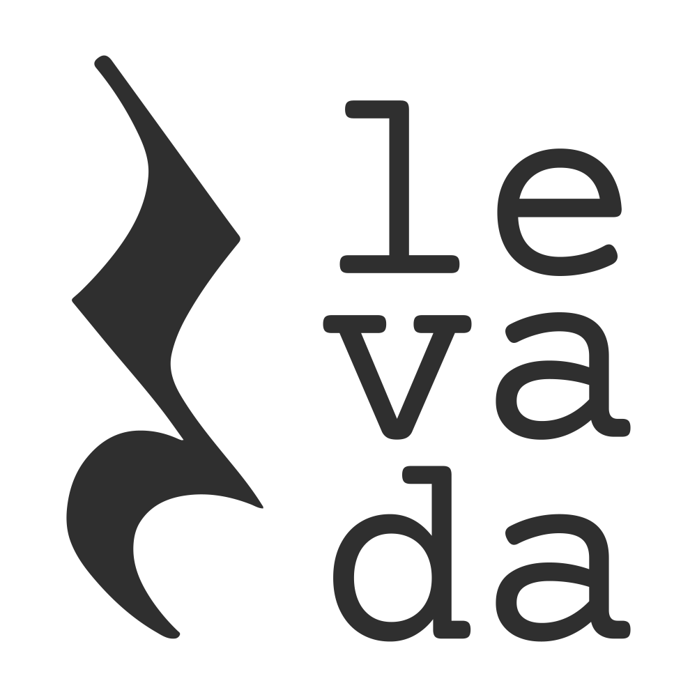

This project aims to be a website in which you can practice your rhythmic solfège through simple
one-beat rhythmic figures.  
  
# Overview  
Sight reading sheet music is a daunting task. Not only do you need to worry about key signatures, accidentals, chords, articulations, but also about rhythm! This project emerged as a result of my journey trying to be a better musician and wanting a good way to practice understanding the most common rhythmic figures. I was heavily inspired by [Saher Galt's videos](https://www.youtube.com/watch?v=Y5_27Gc28ls&list=PLL_-wssODcBPiAtEQYgAMWLj2WJdMvYlm) on rhythm.  
Currently the site is in its barest-bones version possible, but I think it's quite enough to start practicing!

Tested on Chrome, Edge and Firefox. Firefox's audio is janky so it's not ideal to view through there.  
  
# Project Structure  
```bash
├── image-generators
│   ├── lilypond
│   ├── scripts
│   └── templates
├── public
└── src
    ├── assets
    │   ├── RhythmicFigures
    │   │   └─── ...
    │   ├── images
    │   ├── sounds
    │   └── styles
    ├── components
    │   └── ...
    ├── pages
    │   └── ...
    └── utils
```